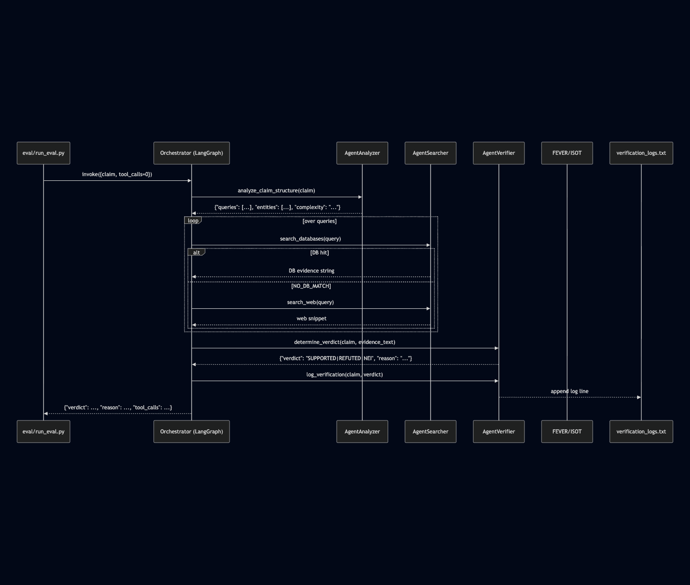

# Architecture: Agentic MCP News Fact-Checker

This document summarizes the **agent roles**, **message/schema design**, and **orchestration flow** for the MCP-based news fact-checker.

---

## 1. Agent Roles & Responsibilities

The system consists of **three MCP agents**, each encapsulated as a separate `FastMCP` server in `mcp_servers/`.

### 1.1 Analyzer Agent (`mcp_servers/agent_analyzer.py`)

- **MCP Server Name**: `AgentAnalyzer`
- **Core Tool**: `analyze_claim_structure(claim: str) -> str (JSON)`
- **Responsibility**:
  - Decompose an input claim into:
    - Key **entities** (persons, orgs, events)
    - A list of **search queries**
    - A heuristic **complexity** rating (High/Low)
- **Output JSON schema** (string):

```json
{
  "entities": ["Barack Obama", "Hawaii"],
  "queries": ["Barack Obama birthplace Hawaii", "where was Barack Obama born"],
  "complexity": "Low"
}
```

Internally, it uses ChatOllama(model="qwen2.5:7b", format="json") to produce this JSON.

---

### 1.2 Searcher Agent (mcp_servers/agent_searcher.py)
- **MCP Server Name**: AgentSearcher
- **Tools**:
    - search_databases(query: str) -> str
    - search_web(query: str) -> str
    - Responsibilities:
        - Offline retrieval:
            - ISOT dataset → labeled REAL/FAKE news headlines.
            - FEVER dataset → labeled SUPPORTS/REFUTES claims.
    - Online retrieval:
        - DuckDuckGo search when no database match is found.
- **Database search behavior**:
    - ISOT:
        - Lowercased titles in isot_index.csv.
        - title_lower.str.contains(query_lower, regex=False) to find matching headlines.
    - FEVER:
        - Linear scan over fever_index.jsonl for substring match in claim.  
- **Return values**:
    - On DB hit(s):
        ```
        [ISOT DB] Headline: '...' | Label: REAL
        [FEVER DB] Claim: '...' | Label: SUPPORTS
        ...
        ```
    - On complete miss:
        ```   
        NO_DB_MATCH
        ```
search_web wraps DuckDuckGoSearchRun.invoke(query) and returns a textual snippet.

---

### 1.3 Verifier Agent (mcp_servers/agent_verifier.py)
- **MCP Server Name**: AgentVerifier
- **Tools**:
    - determine_verdict(claim: str, evidence: str) -> str (JSON)
    - log_verification(claim: str, verdict: str) -> str
- **Responsibilities**:
    - Logical judgment — classify claim as:
        - SUPPORTED
        - REFUTED
        - NEI (Not Enough Info)
	- Persistent logging — append final verdict to data/verification_logs.txt.

- **Verdict JSON schema**:
    ```json
        {
        "verdict": "REFUTED",
        "reason": "Multiple sources indicate the story originated from a known satire or fake news site."
        }
    ```

- **The log_verification tool writes a line like**:
    ```
    CLAIM: Pope Francis Shocks World, Endorses Donald Trump | VERDICT: REFUTED
    ```

---

## 2. Orchestrator & State Schema

The orchestration logic lives in agents/graph.py and is implemented using LangGraph.

### 2.1 Agent State

The shared state between nodes is represented as:

```python
class AgentState(TypedDict):
    claim: str
    queries: List[str]
    evidence: List[str]
    verdict: str
    reason: str
    tool_calls: int
```

Fields:
- claim: Original natural-language claim to fact-check.
- queries: List of search queries produced by the Analyzer.
- evidence: List of textual evidence chunks (DB hits or web snippets).
- verdict: Final classification (SUPPORTED / REFUTED / NEI).
- reason: Short natural-language justification.
- tool_calls: Counter used by the evaluation script to track total tool invocations.

---

## 3. Orchestration Flow (LangGraph)

The orchestrator defines three nodes: Analyzer, Searcher, and Verifier. Data flows sequentially, but each step leverages MCP tools.

### 3.1 Sequence Diagram (End-to-End Fact Check)



---

## 4. Prompt & Contract Design

### 4.1 Analyzer Prompt Contract
```
System role: “You are a structural analyst.”
Task:
    Extract entities, generate two search queries, and rate complexity.
Output requirement:
    Strict JSON matching:
    json
    { "entities": [], "queries": ["q1", "q2"], "complexity": "High|Low" }
```
The orchestrator always expects the queries field and falls back to [claim] on JSON parsing errors.

### 4.2 Verifier Prompt Contract
```
Task:
    Using evidence only, classify the claim as SUPPORTED, REFUTED, or NEI and justify in one sentence.
Output requirement:
    { "verdict": "SUPPORTED|REFUTED|NEI", "reason": "..." }
```
The orchestrator enforces a constraint check:
- If verdict ∉ {SUPPORTED, REFUTED, NEI} → counted as a constraint violation in evaluation.

---

## 5. Metrics & Evaluation

The evaluation script (eval/run_eval.py) uses the Orchestrator as a library and eval/test_cases.json as input.

### 5.1 Test Case Schema

Each test in test_cases.json has:
```json
{
  "id": 1,
  "claim": "Trump says he expects to have second meeting with Putin",
  "expected": "SUPPORTED",
  "difficulty": "Hard"
}
```

### 5.2 Metrics

For each test, the eval script records:
- predicted vs expected
- correct (boolean)
- latency_sec (per-claim runtime)
- tool_calls (final tool_calls from AgentState)
- constraint_violation (true if invalid verdict token)
- reason (for qualitative analysis)

Aggregate metrics printed:
- Success Rate (% of correct == True)
- Average Latency (seconds)
- Average Tool Calls
- Total Constraint Violations

Results are saved to eval/results.csv.

---

## 6. Design Trade-offs & Extensibility

### 6.1 Trade-offs
- Retrieval simplicity:
- Substring matching (fast, easy) instead of full-text search / embedding-based retrieval.
- Single-pass reasoning:
- One Analyzer → Searcher → Verifier pass with no backtracking.
- MCP integration:
- Agents are written as FastMCP servers and can be run as separate processes.
- The orchestrator imports their tool functions directly for simplicity; in a full deployment you would use mcp.client.* to call them over stdio/IPC.

### 6.2 Extensibility Ideas
- Add a Critic Agent that:
- Re-checks the verdict against evidence.
- Flags contradictions (e.g., FEVER SUPPORTS vs ISOT FAKE).
- Introduce confidence scores based on:
- Source (FEVER vs web).
- Complexity rating from Analyzer.
- Replace substring search with:
- BM25, or
- an embedding-based vector search using FAISS / ChromaDB.

