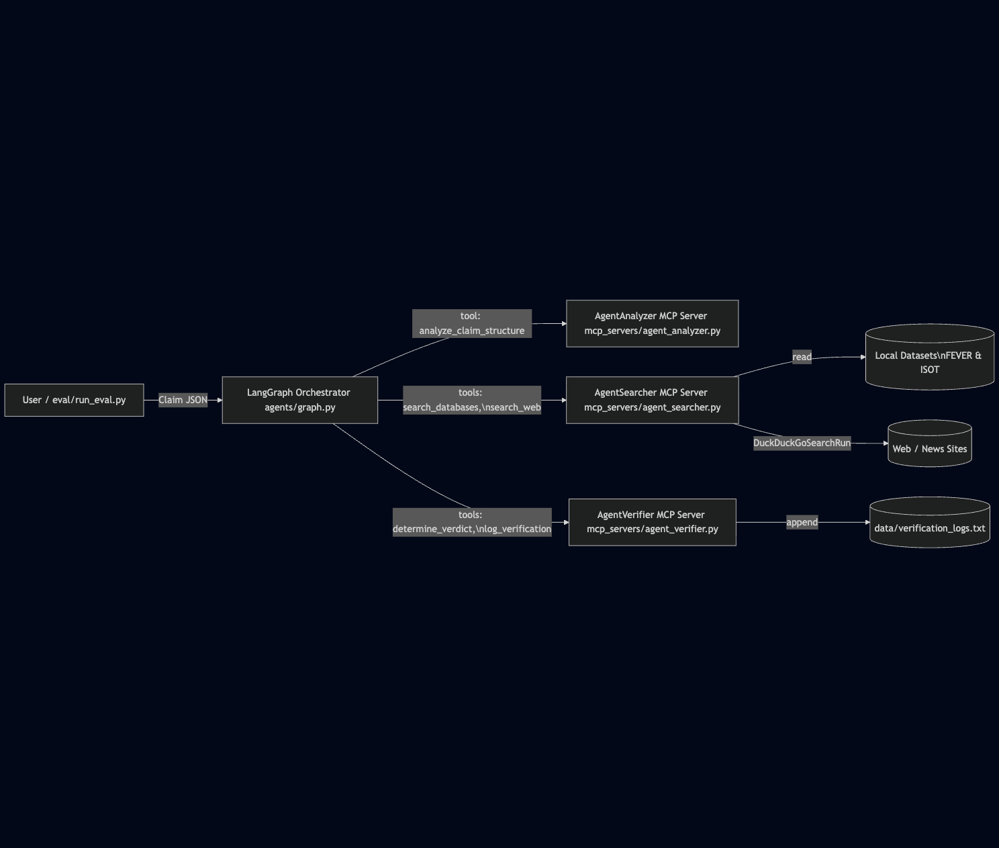

# Agentic News Fact-Checker

A **multi-agent, MCP-based news fact-checker** that verifies natural-language claims using:

- **FEVER** (fact verification)  
- **ISOT** (fake vs real news headlines)  
- **Live web search** (DuckDuckGo)

The system is implemented as **three MCP microservices (agents)** orchestrated by a **LangGraph client**, with a **evaluation strategy** that measures success rate, latency, and tool usage.

---

## 1. High-Level Overview

### What this project does

Given a claim like:

> “Pope Francis Shocks World, Endorses Donald Trump”

the system:

1. **Analyzer Agent** decomposes it into entities and search queries.  
2. **Searcher Agent** checks the **ISOT** and **FEVER** datasets, backed by live web search as a fallback.  
3. **Verifier Agent** decides **SUPPORTED / REFUTED / NEI**, explains why, and logs the result.

All agent logic is exposed as **MCP tools**, and the **LangGraph Orchestrator** composes these tools into an end-to-end workflow.

---

## 2. Architecture Overview

### 2.1 Component Diagram



### 2.2 Agent Roles
- Analyzer (Planner)
- Tool: analyze_claim_structure(claim: str) -> JSON
- Extracts entities, search queries, and a simple complexity score.
- Searcher (Retriever)
- Tools:
- search_databases(query: str) -> str
- search_web(query: str) -> str
- Searches ISOT (fake/real headlines) and FEVER (claims) first; falls back to web search on DB miss.
- Verifier (Judge & Logger)
- Tools:
- determine_verdict(claim: str, evidence: str) -> JSON
- log_verification(claim: str, verdict: str) -> str
- Classifies as SUPPORTED / REFUTED / NEI based only on evidence and logs the decision.

---

## 3. Setup & Installation

### 3.1 Prerequisites
- Python: 3.10+
- Ollama installed and running locally
- Ollama model: qwen2.5:7b

- Pull the model:
    - ollama pull qwen2.5:7b

### 3.2 Python Environment

From the project root:

```bash
python -m venv .venv
source .venv/bin/activate

pip install -U pip
pip install \
    langgraph \
    langchain-core \
    langchain-ollama \
    langchain-community \
    mcp \
    pandas \ 
    duckduckgo-search \
    streamlit
```

---

## 4. Data Preparation

The system expects pre-processed indexes under data/.
- Download original datasets:
    - FEVER: https://huggingface.co/datasets/fever/fever
	- Save the JSONL file as data/fever.jsonl
	- ISOT: https://www.kaggle.com/datasets/emineyetm/fake-news-detection-datasets
	- Place True.csv and Fake.csv in data/

- Run ingestion:
    - python data/ingest_data.py

This will generate:
- data/isot_index.csv
- data/fever_index.jsonl

---

## 5. Running the Evaluation Script

The evaluation script uses the orchestrator as a library and runs a set of JSON-defined test cases.

### 5.1 Test Cases

eval/test_cases.json contains at least 6 programmatic test cases of varying difficulty (Easy / Medium / Hard), each with:
- id
- claim
- expected (SUPPORTED / REFUTED / NEI)
- difficulty

### 5.2 Run Eval

From the project root:

- python eval/run_eval.py

This will:
- Load eval/test_cases.json
- For each test:
- Run the LangGraph pipeline (agents/graph.py)
- Track:
- Prediction vs Expected label
- Latency (per claim)
- Tool call count
- Constraint violations (if verdict ∉ {SUPPORTED, REFUTED, NEI})
- Write eval/results.csv with one row per test case.
- Print a summary like:
```
========================================
FINAL EVALUATION REPORT
========================================
Success Rate:      83.3%
Avg Latency:       4.21 sec
Avg Tool Calls:    4.2
Constraint Errors: 0
========================================
```
---

## 6. Running the Streamlit UI app

```bash
cd mas_factchecker
python -m streamlit run app.py

```

---

## 7. Design Highlights & Limitations

Highlights
- MCP-native agents: Each role is a separate MCP server exposing a small tool surface.
- LangGraph orchestrator: Clean separation between control flow and tool capabilities.
- Grounded evidence:
- ISOT headlines labeled REAL/FAKE.
- FEVER claims labeled SUPPORTS/REFUTES, with evidence references.
- Web search only on DB miss.
- Rigorous metrics:
- Success rate
- Latency per claim
- Tool-call count
- Constraint-violation checks

Limitations / Future Work (for research note)
- Simple retrieval: uses substring match; can be replaced with BM25 / dense retrieval.
- Single-pass reasoning: no iterative critic or self-correction loop.
- JSON robustness: JSON parsing from the LLM is handled defensively, but could be further improved with stricter schemas and validation.


